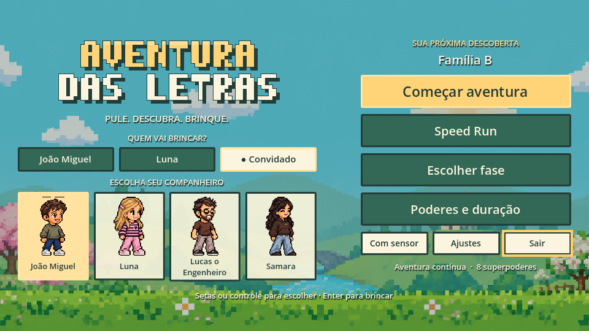
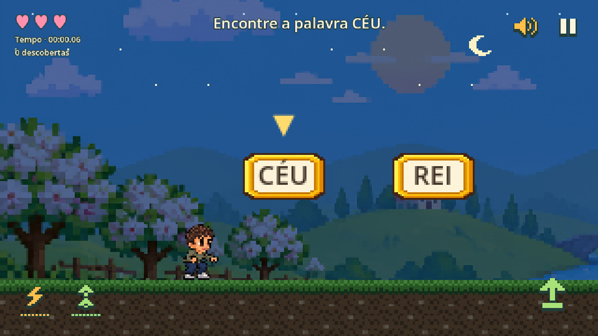
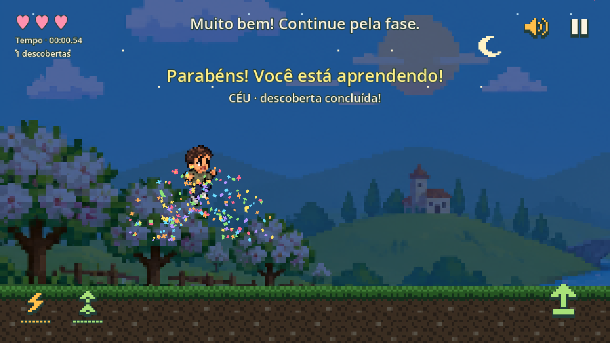
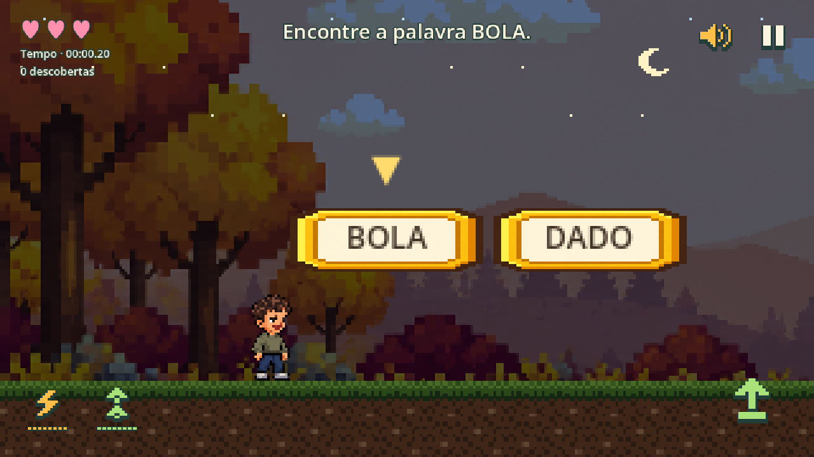

# Aventura das Letras

A Portuguese-language 2D literacy platformer built with Godot. Explore letters, syllables and words using a keyboard, gamepad or optional ESP32 motion sensor.

[Português](README.md) · [Contributing](CONTRIBUTING.md) · [MIT license](LICENSE)

## Play from source

1. Install [Godot 4.7.2 Standard](https://godotengine.org/download/archive/4.7.2-stable/).
2. Clone `https://github.com/Sa-Meneses/aventura-das-letras.git`.
3. Import `game/project.godot` in Godot, wait for assets to import, then press F5.

The game runs locally without an account, API key or sensor. Optional narration depends on your operating system's Portuguese voices. The original development platform is macOS Apple Silicon; Windows/Linux testing is welcome.

## Features

68 stages, 332 activities, four characters, eight powers, continuous adventure and Speed Run. Letters, syllable families, monosyllabic words and 100 disyllabic words. Progress is stored locally, and mistakes preserve discoveries.

The optional ESP32/IMU integration sends USB or local Wi-Fi samples to a Python jump detector. See [sensor setup](docs/SENSOR.md). Hardware behavior needs validation for each setup.

## See the game in action

Original screenshots captured directly from the current game using a test profile.

### Running through word challenges

### A correct answer brings confetti

Collecting **CÉU** with a jump triggers a colorful celebration and an encouraging message.

### Exploring two-syllable words

## Start your own game from scratch

Use the **[customizable master prompt (Portuguese)](docs/PROMPT-MESTRE.md)** to describe your own characters, audience, hardware and visual direction. It guides an assistant through feasibility, a first playable level, artwork, optional motion input and Markdown documentation. You can also fork this repository to adapt the existing game.

## Development

Use Python 3.10+ and Godot 4.7.2. `python3 tools/run_game.py` locates Godot automatically; set `GODOT_BIN` if needed. Run `python3 tools/check_publication.py` and `python3 tools/run_tests.py` before contributing. USB dependencies are listed separately in `requirements-sensor.txt`.

Issues and pull requests in English or Portuguese are welcome. See the [roadmap](ROADMAP.md). Built with assistance from Codex; artwork was generated with an integrated image tool whose exact model version was not exposed. Source code, documentation and project-owned published assets use the MIT license; see [third-party notices](THIRD_PARTY_NOTICES.md).
